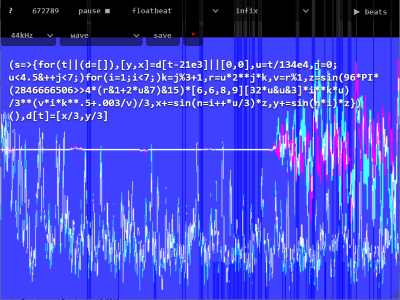

# Etude de la synthèse additive - 256b bytebeat - Lovebyte 2023

This repository contains the source code for the 256b bytebeat song "Etude de la
synthèse additive", made by pestis / brainlez Coders! and released at Lovebyte
2023 256b bytebeat music compo. This song is accompanied by a Lovebyte 2023
seminar talk, which explains the underlying concepts how the song was composed.

Should be played with the following settings:
- floatbeat
- infix
- 44 kHz

Greets to superogue, havoc, ttg, p01, psenough, jeenio, HellMood, jobe, nesbox,
dave84, TomCat, exoticorn, ferris, Jin X, unlord, gopher, okkie, Řrřola, hannu,
wrighter, Dresdenboy, aldroid, baze, noby, PoroCYon, DevEd, byteobserver,
sensenstahl, Virgill, Ped7g, gasman, LJ, ilmenit, deater, Fready, Blossom and
everyone at the Sizecoding discord!

Listen on the
[dollchan](https://dollchan.net/bytebeat/#v3b64LZDLasMwEEX/RRAjjYZYsmQnaTJZFror3QotnMYF23kU2zJ5OP9epe3szuFyYe6dfZ73FXthvKft/evc8WGa+J6cF+iuePG0d0caZpmujJ8mp1B5DDSk2tjKYkNqHTZ2nidSNpvFWjwbatLr+gktNTMjNXYUIANooMWRupnGG/X1ia8KeH8Dni1tES9XxXZrgXeJlhmEZCESnQtwBRa4xJV35mlDYjzUAC0EkRoAPkZqAea5nCtl0jFavMjf/hPVUkJIjYAbXv8d1JEegguMj3lyl5i/psYzZH15/D5UH+UQ97BWK4Xs+DfO6+FcDruqHNjjBw)
or the
[greggman](https://greggman.com/downloads/examples/html5bytebeat/html5bytebeat.html#t=1&e=0&s=44100&bb=5d00000100fe0000000000000000141cc3a3e33cc5579210f1269c28a1abd55408d67a32dadeb3e43fb91060515a0fd17abea608175ae02b8f36f56891676427b947e46d5bfabd11b9e9761f4aebfa5c4fa6b4b49bbb9168f137ad1ebf1653bcfbe270c56fc09ca83454f571e9f13a5453f40661e6fcfb6153baf6a4cf8e206dc3d10fc99085b546fc9a8680f6dc685720dbd74428881c961c47f43ec3ec81e0b4cae1e3c6e094bcdc61284abc1f043ef0fbd1053a194aafcfe1f9d9bf14db9b37c27e4453bb9f7c1f9d16f462663746550ad52a555a6f903e3a8e37485b243aa2285f5304085ffde21240)
bytebeat player.

Note that in the greggman version the delay buffer is implemented without a ring
buffer, because greggman player does not guarantee that the function is called
always in time order, probably due to the visuals. That fix actually saves 2
bytes, but now leaks memory: the delay buffer just keeps on growing all the
time. But modern computer should not run out of memory in the duration of the
song.

## Technical

"Additive synthesis" of sound is traditionally defined as adding up the output
from several sinusoidal oscillators, each with different weights and typically
running at integer multiples of the fundamental frequency. These are called
'partials'. By doing this, one can theoretically reproduce the tone quality of
any periodic sound, because this is essentially just a (truncated) Fourier
series.

But looking more generally what this is doing, it takes a simple oscillator
(sine wave) and sums up several versions of it, each slightly varied, to make a
sound that is far more complex than the original. If we generalize the
definition of "additive synthesis" as "adding up several versions of the same
sound, each slightly varied, to make a more complex sound", you can think of
this song as having three different types of "additive synthesis":

1) Each note is synthesized using a fairly standard additive synthesis, with
   sinusoidal partials. Each oscillator has its own amplitude envelope with
   sharp attack and slow decay; higher frequency partials decay faster. There is
   three different instruments (index k=1..3) which have their partials at
   frequencies f ~ n^k. The k=2..3 create more bell-like instruments, while k=1
   has a more saw tooth shape. The weights of the partials are slightly
   different for the left and right stereo channel, and the weights evolve
   slowly with time.
2) A simple melody pattern was built from the notes of a min7 chord and stored
   in an integer. The frequencies were justly tuned according to the five-limit
   tuning. However, to keep things interesting, depending on the part of the
   song, we always pick some of the notes of the pattern, based on a simple bit
   pattern function. It doesn't quite matter which notes we pick, because
   whatever notes of the min7 chord they are, they tend to harmonize just fine
   together. i-iv-v chord progressions are added on top, by moving all note
   pitches up by a perfect fourth or a perfect fifth, depending on the measure.
   The chord is chosen based on another bit pattern function. All of this gives
   simple short looping melodies, coming from the notes of imin7, ivmin7 or
   vmin7 chords. Note that these chords are all from one diatonic scale. We then
   play several versions of this melody, with varying instruments and stretched
   to different durations in time, on top of each other. All the melody loops
   harmonize quite nicely, as they are playing the notes of the same min7 chord,
   and because their durations are small integer number ratios, the loops also
   align rhytmically. This can be viewed as another type of "additive
   synthesis", only where we add up several looping melodies, instead of
   oscillators.[^1]
3) Finally, there is a feedback delay effect. The delay is a ping pong delay, so
   right channel signal appears delayed in the left channel and vice versa. The
   result of this delay is to add several copies of the entire song on top of
   each other, each time-shifted (and progressively reduced in volume). If you
   squint really hard, you can view this as a third type "additive synthesis".

[^1]: I call this the "Brian Eno / P01" trick, because Brian Eno used fairly
    similar technique to compose "Ambient 1: Music for Airports" in 1978 and in
    2018, P01 used this trick to make music in his 256b javascript production
    "Music for Tiny Airports." Read P01's [write
    up](http://www.p01.org/music_for_tiny_airports/) and listen to [Brian
    Eno](https://www.youtube.com/watch?v=vNwYtllyt3Q).
